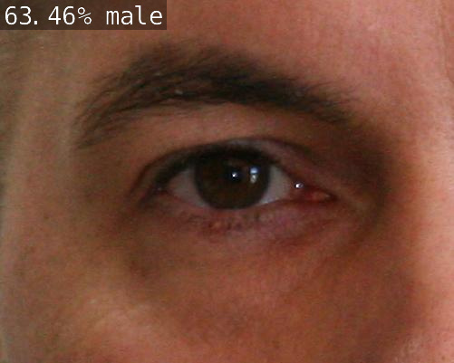

Getting Started
===============

.. _installation:

Installation
------------

.. note::

   The following steps are for the Jetson Nano

1. First lets go into the correct directory, go into ``jetson-inference/python/training/classification/data``

2. To get the data, first install the ``tar.gz`` file:

.. note::

    You will need an ethernet cord plugged in or a wifi connection to complete this step

.. code-block:: console

    $ wget https://github.com/devium335/genderAEye/releases/download/v0.1.0/projects.tar.gz -O genderAEye.tar.gz

3. Now unzip the the file you just downloaded:

.. code-block:: console

    tar xvzf genderAEye.tar.gz

.. _training:

Training
--------

1. Now go to the ``jetson-inference`` folder and open the docker container:

.. code-block:: console

    $ ./docker/run.sh

2. Now in the docker container change directories so you are in ``jetson-inference/python/training/classification``

3. Now run the training script to train the network. The ``model-dir`` argument should be where the model is saved and where the data is kept:

.. code-block:: console

    $ python3 train.py --model-dir=models/genderAEye data/genderAEye

.. note::

    While it's running, you can stop it at any time using ``Ctl+C``

.. _exporting:

Exporting
---------

Now that you have trained the ResNet model you will need to convert it into ONNX format. ONNX is an open model format that supports many popular machine learning frameworks, and it simplifies the process of sharing models between tools. 

1. Make sure you are in the docker container and in the ``jetson-inference/python/training/classification`` directory

2. Run the onnx export script:

.. code-block:: console

    $ python3 onnx_export.py --model-dir=models/genderAEye

Look in jetson-inference/python/training/classification/models/genderAEye to see if there is a new model called resnet18.onnx there

.. _Processing:

Processing
----------

In order to see how your network functions you can run images through them. You can use the imageNet command line arguments to test out your re-trained network.

1. Exit the docker container by pressing ``Ctl + D``

2. On the nano, make sure you are in the ``jetson-inference/python/training/classification`` directory

3. Make sure that you have the model on your nano, you should see a file called ``resnet18.onnx``

.. code-block:: console
    
    ls models/cat_dog/
    
4. Set the NET and DATASET variables

.. code-block:: console

    $ NET=models/cat_dog
    $ DATASET=data/cat_dog

5. Run this command to see how it operated on an image from the male folder.

.. code-block:: console

    $ imagenet.py --model=$NET/resnet18.onnx --input_blob=input_0 --output_blob=output_0 --labels=$DATASET/labels.txt $DATASET/test/male/C1_S1_I1.jpg male.jpg

6. Use scp to look at the image on your host computer

**Windows:**
.. code-block:: console

    $ scp <nanousername>@192.168.55.1:/home/<nanousername>/jetson-inference/python/training/classification/male.jpg C:\Users\<hostusername>\Desktop

**Mac:**
.. code-block:: console

    $ scp <nanousername>@192.168.55.1:/home/<nanousername>/jetson-inference/python/training/classification/male.jpg ./

